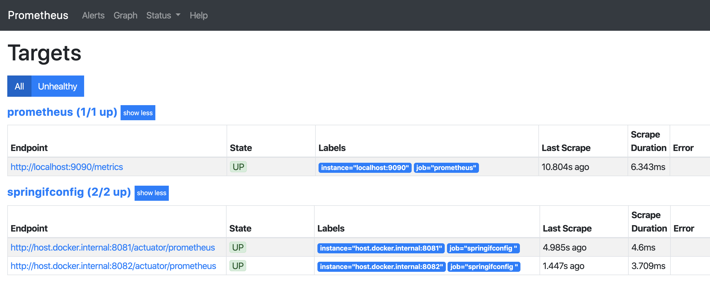
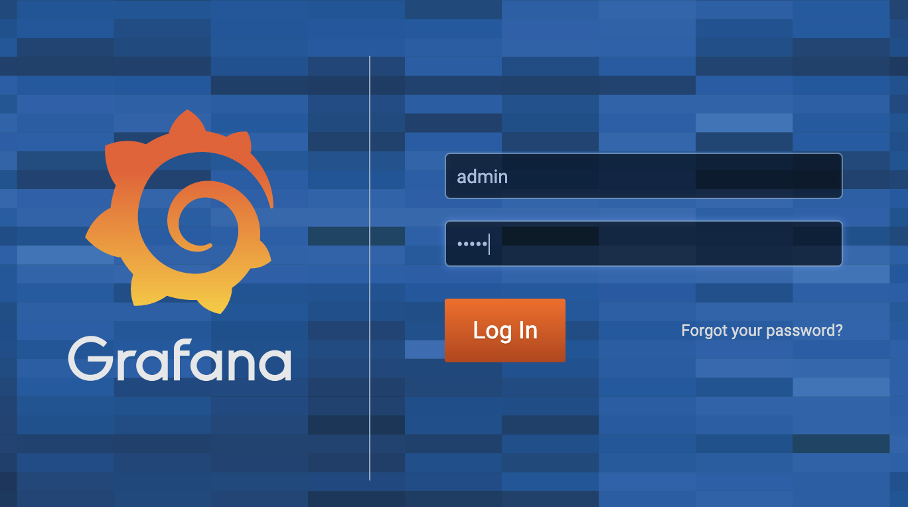
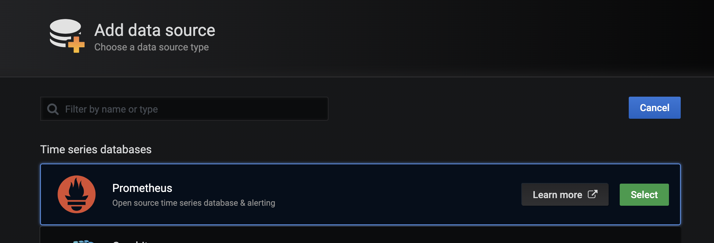
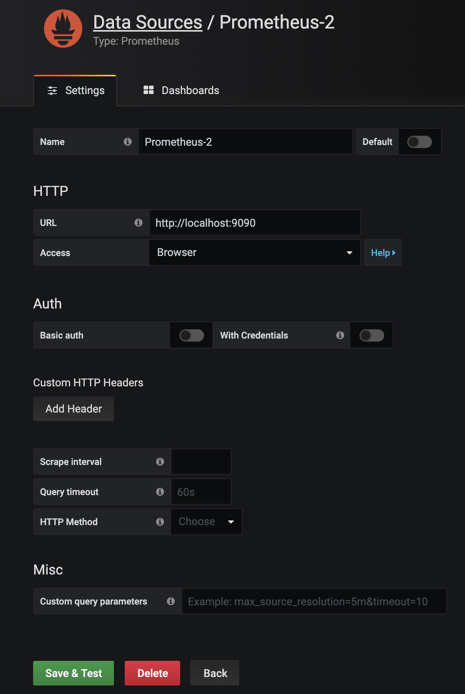
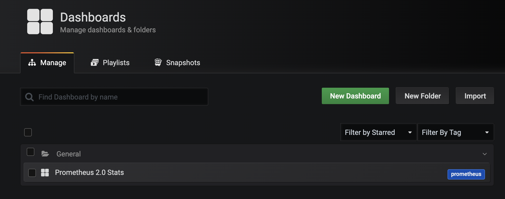
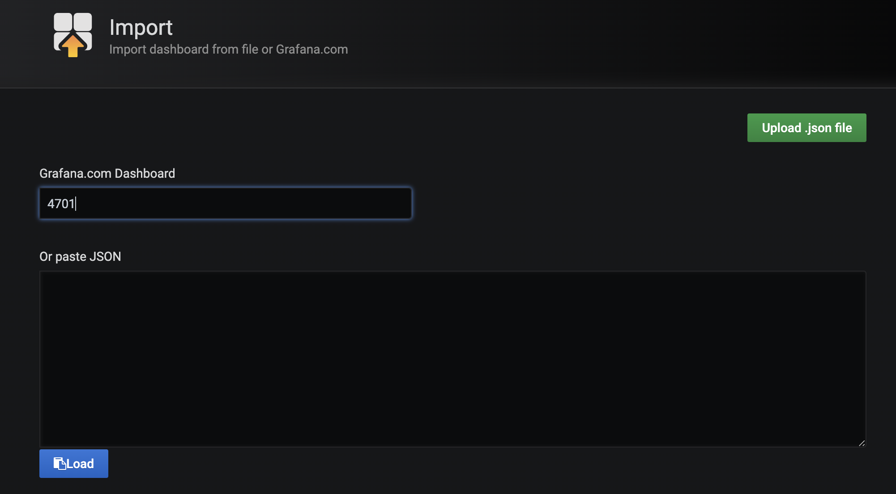
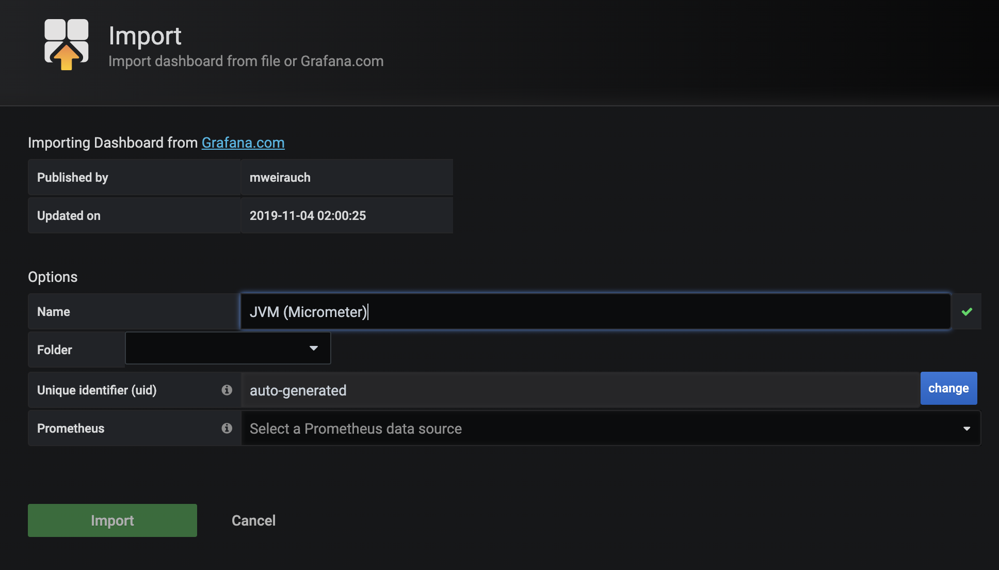
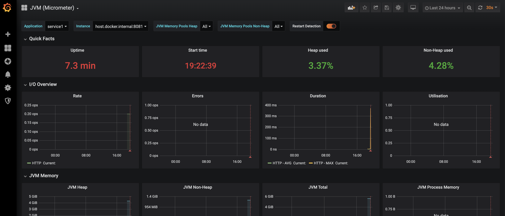
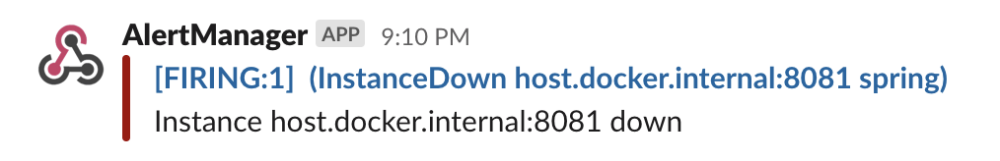

# prometheus_demo

## spring boot2 / Micrometer x Prometheus

### Micrometer
Micrometer is the metrics collection facility included in Spring Boot 2’s Actuator.<br>
[Micrometer: Spring Boot 2's new application metrics collector](https://spring.io/blog/2018/03/16/micrometer-spring-boot-2-s-new-application-metrics-collector)

[Supported Metrics](https://docs.spring.io/spring-boot/docs/current/reference/htmlsingle/#production-ready-metrics-meter)

* JVM metrics, report utilization of:
  * Various memory and buffer pools
  * Statistics related to garbage collection
  * Threads utilization
  * Number of classes loaded/unloaded
* CPU metrics
* File descriptor metrics
* Kafka consumer metrics (JMX support should be enabled)
* Log4j2 metrics: record the number of events logged to Log4j2 at each level
* Logback metrics: record the number of events logged to Logback at each level
* Uptime metrics: report a gauge for uptime and a fixed gauge representing the application’s absolute start time
* Tomcat metrics (server.tomcat.mbeanregistry.enabled must be set to true for all Tomcat metrics to be registered)
* Spring Integration metrics

### Prometheus
An open-source monitoring system with TSDB, metrics and alerting.<br>
[GETTING STARTED](https://prometheus.io/docs/prometheus/latest/getting_started/)

## Configuration
#### dependency
```
implementation("org.springframework.boot:spring-boot-starter-actuator")
implementation("io.micrometer:micrometer-registry-prometheus")
```

#### prometheus.yml
```
scrape_configs:
  - job_name: 'prometheus'
    static_configs:
      - targets: ['localhost:9090']

  - job_name: 'spring'
    metrics_path: '/actuator/prometheus'
    scrape_interval: 5s
    static_configs:
      - targets: ['host.docker.internal:8081', 'host.docker.internal:8082']
```

### application.yml
```
management:
  endpoints:
    web:
      exposure:
        include: prometheus # explore the prometheus endpoint
  metrics:
    use-global-registry: true # use global registry
```

#### docker-compose.yml
```
version: '3'
services:
  prometheus:
    image: prom/prometheus
    ports:
      - 9090:9090
    volumes:
      - ./prometheus:/etc/prometheus
      - ./prometheus/data/:/prometheus/ #<- Export prometheus data
  grafana:
    image: grafana/grafana
    container_name: grafana
    volumes:
      - ./grafana-data:/var/lib/grafana
    ports:
      - 3000:3000
```

Access to http://localhost:9090/targets.

It is shown that metrics collection started.<br>


## Grafana
Grafana is the open source analytics and monitoring solution for every database

Access to http://localhost:3000.

1. Login with following account.<br>
  username: admin<br>
  password: admin<br>
  

2. Add data source.<br>
  1. Select the `Prometheus`.<br>
  
  2. Configure as below.<br>
  

3. Configure Dashboard
  1. Dashboard > Manage > Import<br>
  
  2. Input a dashboard url or id. (I'm using [JVM (Micrometer)](https://grafana.com/grafana/dashboards/4701) in this example)<br>
  
  3. Import!<br>
  
4. Here is dashboard.


## Alerting
[ALERTING RULES](https://prometheus.io/docs/prometheus/latest/configuration/alerting_rules/)

Sample of alerting to slack.<br>

#### prometheus.yml
```
alerting:
  alertmanagers:
    - static_configs:
        - targets: ['host.docker.internal:9093']
```
※ Because Prometheus is built with a Docker container in this example, `localhost` point to the Prometeus container itself.

#### alertmanager.yml
```
route:
  receiver: 'slack_alert'
receivers:
  - name: 'slack_alert'
    slack_configs:
      - api_url: 'https://hooks.slack.com/services/XXXXXXX/XXXXXXX/XXXXXXX'
        channel: '#alert_test'
        text: "{{ .CommonAnnotations.summary }}"
        send_resolved: true
```

#### rule.yml
Alert for any instance that is unreachable for >20 seconds.
```
groups:
  - name: example
    rules:
      - alert: InstanceDown
        expr: up == 0
        for: 20s
        annotations:
          summary: "Instance {{ $labels.instance }} down"
          description: "{{ $labels.instance }} of job {{ $labels.job }} has been down for more than 20 seconds."
```

#### docker-compose.yml
```
alertmanager:
    image: prom/alertmanager
    ports:
      - 9093:9093
    command:
      - --config.file=/etc/alertmanager/alertmanager.yml
    depends_on:
      - prometheus
    volumes:
      - ./prometheus/alertmanager.yml:/etc/alertmanager/alertmanager.yml
```
